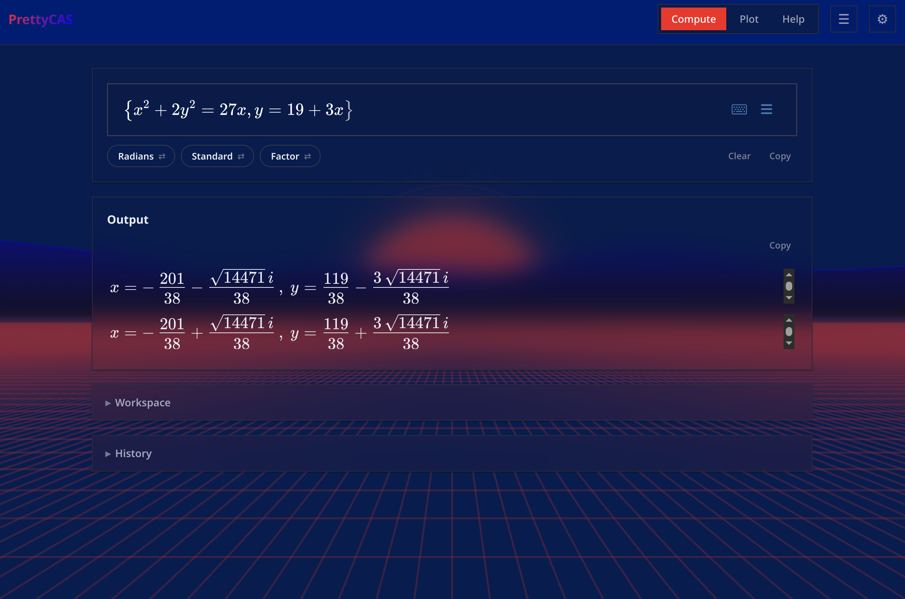
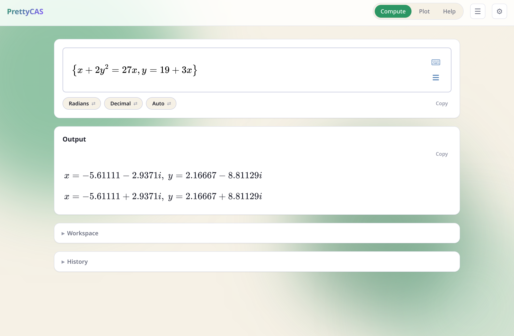
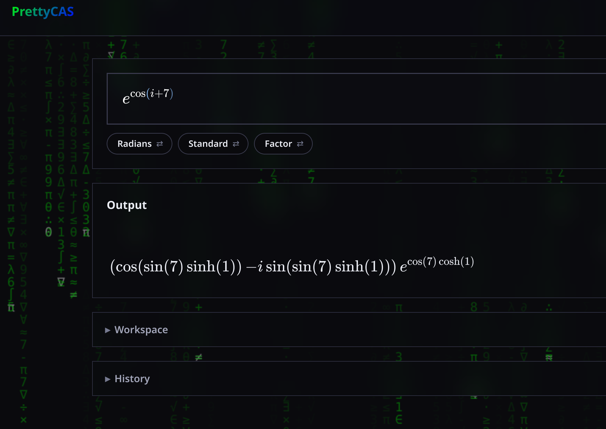
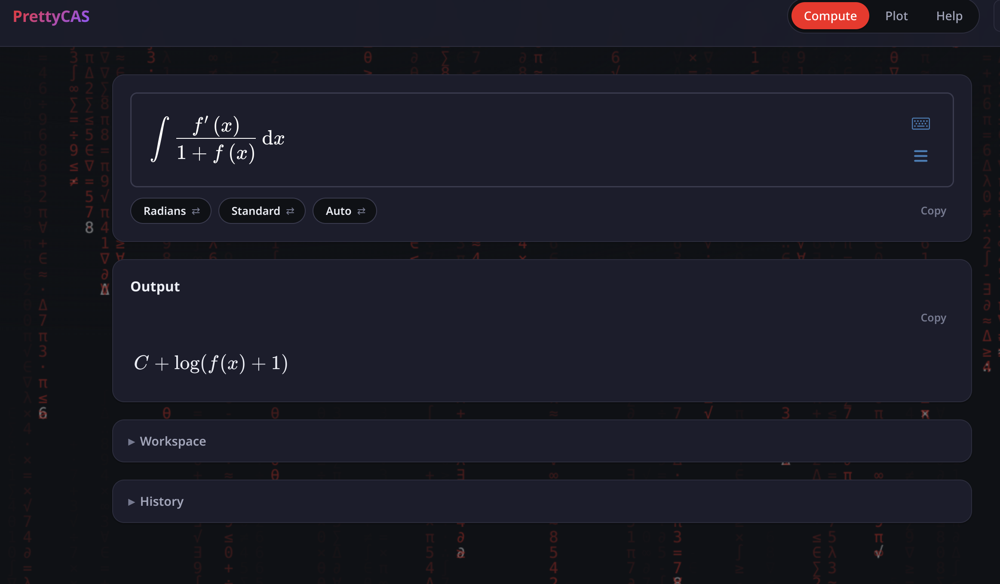
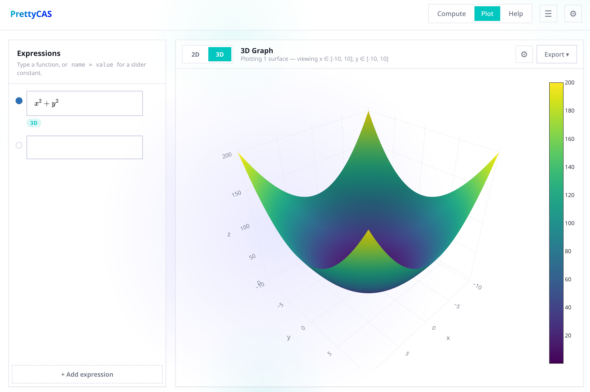

# PrettyCAS

There is lots of powerful software out there to solve general purpose math problems but in my opinion it all has shortcomings. Wolfram Alpha is very powerful but has a very crusty interface to put in maths and also can have finicky syntax (maybe by being too smart), Symbolab has also been pretty good, having a nice balance between a nice front-end UI to type interactive equations into and a decent engine, however it still isn't perfect. So I attempted to make something that does both.

The goal is for it to seem like you are using an equation editor that is super easy and intuitive to interact with (similar to MS Word where natural typing habits are picked up on, fortunately someone has made something exactly like this called MathLive and so I have to do no hard work). MathLive can output MathJSON which is a nice tree style structure to fit mathematical expressions, and with the help of AI a Python backend will take in the MathJSON from the input and feed it into the SymPy library which again makes my job easy. The Python backend then sends the result to the frontend for it to be displayed.

To use MathLive it needed to be a web interface anyway so I got carried away and told the AI to add lots of effects like matrix rain and make it look really cool, but really the goal is combining the two projects of MathLive and SymPy to have a powerful calculator app. I also let the AI have a shot at doing plotting for convenience and I tried to get it to be nice but it's just there for convenience, it's not really what I made the project for.

I am not a programmer, I made this project in a weekend because I wanted a good calculator, yes it's pretty much all AI, use the project if you want otherwise don't.

## Screenshots

Same system, exact vs. decimal:

| Standard | Decimal |
|---|---|
|  |  |

Complex evaluation:



Integrating in terms of an abstract function:



3D plotting:



## Functionality

- Basic computation and simplification (standard/expand/factor, exact or decimal, engineering notation)
- Complex numbers
- Matrices (determinant, inverse, solving for an unknown matrix)
- Algebra - closed-form (CAS) solving, falls back to numeric if unsolvable
- Equations, systems of equations (`{ }` syntax), and inequalities
- Integrals (definite/indefinite)
- Derivatives
- Limits
- Summation
- Products
- ODEs
- Systems of ODEs
- 2D/3D plotting - implicit or explicit, log scaling, custom colour maps, export to SVG/PDF/EPS/PNG
- Session **Workspace** (`d = 5` remembered for later inputs) and persistent **History**
- **Help** page that self-tests its examples live against the running backend
- **Misc** page - coming soon (eigenvalues, cross-correlation, convolution, moving averages)

## How it works
### Compute
- You type an equation into a MathLive field; the browser converts it to MathJSON.
- The frontend POSTs that MathJSON to the Flask backend (`/api/compute`), which turns it into a SymPy expression.
- Results come back as both plain text and LaTeX, rendered back into the page.
- A session-only **Workspace** panel lets you save variables e.g. `b = 2` and reuse `b` in later inputs; **History** persists past inputs across restarts (Workspace doesn't).
### Plot
- The Plot page samples an expression over a domain server-side (`/api/sample`) and draws it with Plotly; there is a crusty export option which will use matplotlib to save the plot.
- Can do 2D and 3D, implicit or explicit; 2D allows log scaling and 3D can have a custom colour map, but don't expect a whole lot, the goal is to be similar to Desmos.

## Installation

Requires [Python](https://www.python.org/downloads/) 3.10+ and [Node.js](https://nodejs.org) (for `npm`) to be installed and on your PATH — that's it, the install script handles everything else.

Builds with PyInstaller and installs a launchable app (Start Menu / app launcher entry), user-local, no admin/sudo required. It sets up the Python virtual environment, installs the backend (`pip`) and frontend (`npm`) packages on first run — skipping any of that on later runs unless `backend/requirements.txt` or `frontend/package.json` changed — then builds and installs. Re-run it any time after changing source.

### Linux
```bash
./install-linux.sh
```

### Windows
```powershell
.\install-windows.ps1
```
If Windows blocks the script with an execution-policy error, run it once via:
```powershell
powershell -ExecutionPolicy Bypass -File install-windows.ps1
```

### Quick start (any OS, no install)

Once `install-linux.sh`/`install-windows.ps1` has been run at least once (so the venv and packages exist), you can skip building/installing and just run it directly:
```bash
cd backend
.venv/bin/python desktop.py
```
(Windows: `cd backend`, then `.venv\Scripts\python desktop.py`)

This opens PrettyCAS in a native window directly, without a Start Menu / app-launcher entry.

## Layout

- `backend/app.py`  Flask routes (`/api/compute`, `/api/sample`, `/api/export`, `/api/capabilities`) and static frontend serving.
- `backend/desktop.py`  desktop entry point (runs the Flask server + a pywebview window).
- `backend/functions/`  MathJSON -> SymPy conversion, compute dispatch, solvers, plot sampling/export. `maxima_bridge.py` is an optional fallback to a system `maxima` install for integrals SymPy can't close.
- `frontend/`  single-page app: `index.html`/`shell.js` own shared chrome and switch between views (no separate HTML pages per view). `pages/app.js` (Compute), `pages/plot.js` (Plot), `pages/help.js` (Help, self-tests its examples against the live backend), Misc (placeholder, inline markup in `index.html`). `theme/`  appearance/animation: `theme-init.js` (pre-paint theme flash guard) and `background-fx.js` (the canvas background effects).
- `prettycas.spec`  PyInstaller build spec. Swap `icons/icon.svg`/`icons/icon.png`/`icons/icon.ico` (same filenames) to rebrand.
- `icons/`  the app icon (SVG source plus generated PNG/ICO).
- `scripts/test.sh`  runs the whole test suite (see Testing above).
- `backend/tests/`, `backend/requirements-dev.txt`  pytest suite and its test-only dependency.
- `frontend/tests/`  headless-Chromium E2E suite (`node --test`).
